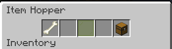
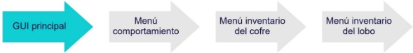
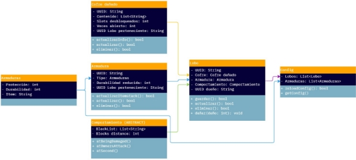

## **Descripción**
Este plugin tiene como objetivo crear armaduras para tus lobos, de modo que puedan soportar mucho daño.

Para lograr este efecto, simplemente podríamos reducir en un porcentaje el daño que el lobo recibe.

Las armaduras podrían ser creadas por el usuario, siguiendo la siguiente configuración:
## **Armaduras**
Cada que el lobo reciba daño, este será reducido en el porcentaje especificado, así, si el lobo tiene una armadura de Netherite y recibe un ataque de 4 corazones, este únicamente recibirá un daño de 2 corazones.

La durabilidad será reducida por ataque, es decir, por cada vez que el lobo es atacado, la durabilidad se reducirá en 1.

La durabilidad del ítem será mostrada en su lore, mientras que esta será almacenada en un NBT.
## **Configuración**
~~~
##########################
#       Armors info
##########################

#Protection:
# - This value could be with % or not, it doesn't matter.
# - It has been only tested with values within 0 and 100, lower or greater are not safe.
# - The protection works in percentage, so, if a wolf with armor protection 50% gets
#    10 of damage, it will only get 5.

#Durability:
# - The durability is reduced by one each time the wolf gets damage

#Item:
# This version works great on 1.19, but item names may change
# by mc version, if it's your case, just change the item names
# according your mc version. To see the material name, just go to google and
# type: Spigot ${your version} material
# then, look your item using ctrl + f and use that name.

#Local placeholders:
# - ${lostedDurability}: Represents the durability losed.
# - ${durability}: Represents the max durability.
# - #{protection}: Represents the protection percentage.

Armors:
    Leather:
        Protection: 10%
        Durability: 60
        Item: "LEATHER_HORSE_ARMOR"
        Displayname: "&6Basic wolves armor."
        Lore:
            - "&eDurability: &e${lostedDurability}/&a${durability}"
            - ""
            - "&eThis armor protects: &a${protection}%"
~~~
## **Indicación de armaduras**
Para indicar qué tipo de armadura tiene tu lobo, vamos a añadirle una pequeña GUI. Cada que se haga clic derecho sobre un lobo domesticado de tu propiedad se abrirá una GUI dónde podrás visualizar un pequeño inventario para tu lobo.

*Ilustración 1, GUI*

Si se es el dueño del lobo, podrás modificar las características de cada slot, si no, solamente podrás visualizar las características.
## **Condiciones**
- Este slot puede ser directamente reemplazado con una armadura válida, en caso de que no se trate de una armadura válida, se cancelará la acción.
- Sino se tiene una armadura, el slot será reemplazado por un panel verde (si se tiene permisos) o rojo (sino se tiene permisos)
- Si se desea remover, basta con dar clic izquierdo y arrastrarlo a tu inventario.
- La armadura podría tener una durabilidad específica, y cuando esta llegue a 0, ser romperá y desaparecerá del inventario del lobo.

*Ilustración 2, GUI, con permisos de armadura*

*Ilustración 3, GUI, sin permisos de armadura*

## **Comportamiento**
El hueso permitirá cambiar el comportamiento de tu lobo, pudiendo cambiar entre: **agresivo, pasivo y** neutral.

El modo **agresivo** atacará a cualquier entidad que esté dentro de un radio definido en la configuración.

El modo **pasivo** evitará que el lobo ataque sin importar qué.

El modo **neutral** permitirá al lobo atacar únicamente si su dueño ha sido atacado o su dueño ha atacado alguna entidad. Este comportamiento es el default.

Para seleccionar el modo, se dará clic derecho en el hueso para rotar la configuración.
## **Configuración**
~~~
##########################
#     Behaviour info
##########################

#MaxRadius:
# - The max radius around the wolf to find targets

#IgnoreMobs:
# - A list of mobs whose will be ignored, custom names aren't supported unless someone request it

Behaviour:
  Agressive:
    MaxRadius: 6
    IgnoreMobs:
      - PLAYER
      - CREEPER
  Neutral:
    IgnoreMobs:
      - CREEPER
      - SKELETON
~~~
## **Cofre**
Este slot permitirá añadirle al lobo un pequeño inventario para almacenar ítems. Los slots disponibles pueden variar dependiendo el nivel del mismo. Este nivel puede ser personalizado.

Para poder insertar un cofre, se seguirá la misma lógica que con la armadura (Ilustración 2, GUI, con permisos de* armadura*).* Si se tienen permisos y no hay cofre colocado, se colocará un **panel verde,** caso contrario un panel rojo. 

Para añadir un cofre basta con arrastrar un cofre válido a dicho slot y automáticamente se colocará.

Para acceder al inventario del lobo, se tendrá que dar clic derecho en este slot.

Si se desea remover, basta con dar clic izquierdo y arrastrarlo a tu inventario.

El cofre podrá tener distintos niveles, indicando así su capacidad máxima (slots), esto puede ser configurado por el usuario.
## **Configuración**
~~~
##########################
#       Chests info
##########################

#Slots:
# - This value will set the amount of slots available.

#Item:
# This version works great on 1.19, but item names may change
# by mc version, if it's your case, just change the item names
# according your mc version. To see the material name, just go to google and
# type: Spigot ${your version} material
# then, look your item using ctrl + f and use that name.

#Info about DamagedChest:
#   When a wolf dies and it has a chest equiped, this chest will "get damaged",
#   once a chest is damaged, it can only be openned a determined amount of times,
#   this to prevent storage abuse and to prevent items loosing by drop.

#CanOpenAfterDamaged:
# - This value will allow open a Damaged chest a determined amount of times, once
#   this limit is reached, the chest will get destroyed

#Local placeholders:
# - ${slots}: Represents the amount of slots available to usage.
# - ${remaining_opens}: Represents the amount of times the chest can be opened before
#   it gets destroyed
Chests:
    Level1:
        Slots: 4
        Item: "CHEST"
        Displayname: "&aChest level 1"
        CanOpenAfterDamaged: 3
        Lore:
            - "&eSlots: &a${slots}"
        LoreWhenDamaged:
            - "&eYou can still open it &a${remaining_opens} times"
            - "&ebefore it gets destroyed."
~~~
##
##
## **Eventos**
## **Muerte del lobo**
Si el lobo muere, la armadura y el cofre serán dropeados.
## **Cofre**
Si el cofre tenía objetos dentro de él, se le añadirá a su NBT una ID única para así, al dar clic derecho con el cofre, se pueda acceder. Para evitar que este cofre se convierta en un tipo de almacenamiento portátil masivo, se añadirá una flag de modo que indicará que ese cofre dropeado ha sido debido a que el lobo murió, entonces, se podrá decir que el cofre ha sido **dañado**, una vez dañado el cofre, sólo se permitirá abrirse un total de 3 veces (También configurable) y una vez consumidas, el cofre desaparecerá, produciendo un sonido de ítem roto y pasando a tu inventario los objetos que hayan quedado dentro, sino hay suficiente espacio en el inventario del jugador, los ítems serán dropeados alrededor de este.

Este comportamiento **solo aplicará si el mob ha muerto**, si se consigue un cofre totalmente nuevo, no se podrá abrir usando clic derecho.
## **Almacenado de datos**
## **Lobos**
Ya que un registro de lobo puede o no tener cofres, armaduras o comportamiento, la forma de guardado será en el siguiente formato:
~~~
UUID del lobo:
  Chest: #Objeto serializado, sino se tiene nada devolverá null
  Armor: #Objeto serializado, sino se tiene nada devolverá null
  Behavior: #Objeto serializado, sino se tiene nada devolverá null
~~~

Si el lobo muere, se eliminará su registro.
## **Cofres**
Ya que los cofres pueden ser dropeados luego de que el lobo muere, se deberán guardar en un archivo temporal.

itemStack serializado: objeto cofre serializado.

El “objeto cofre serializado” será actualizado cada vez que se acceda al inventario del cofre, en cuanto se rompa el cofre, el registro completo será eliminado, si el cofre no es levantado y se elimina (Life-time, damage, killed) también se removerá de los registros.
## **Macroproceso**
## 
*Ilustración 4, Macroproceso*
## **UML clases**
## 
*Ilustración 5, UML de clases*
## **Permisos**
- Añadir cofre a lobo: wolves_armor_set_armor
- Añadir armadura a lobo: wolves_armor_set_chest
- Editar lobo de otros: wolves_armor_edit_others
- Visualizar contenido del lobo de otros: wolves_armor_see_others
